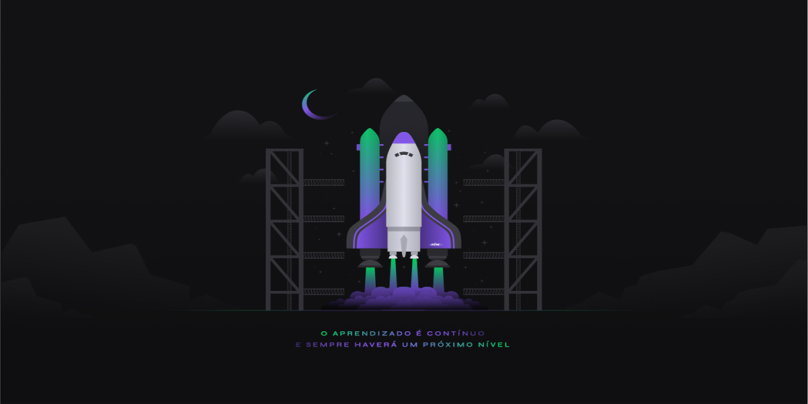
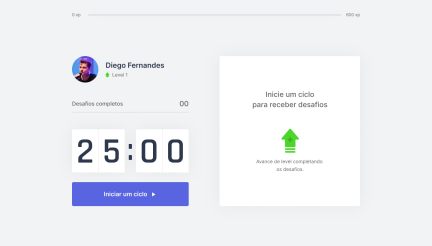
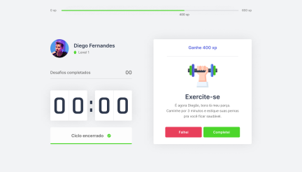

# NLW4 - Moveit App

Aluno: Brenno

### aula - 01 Trilha ReactJS
- [x] Configuração do ambiente de desenvolvimento
- [x] O que é reacJS
- [x] Instalação e configuração do ReactJS
- [x] Typescript
- [x] Criar projeto com ReactJS
- [x] Componentes
- [x] Estado
- [x] Propriedade
- [x] Add font externa
- [x] responsividade
- [x] codigo do desafio da aula-01 "#rumoaoproximonivel"